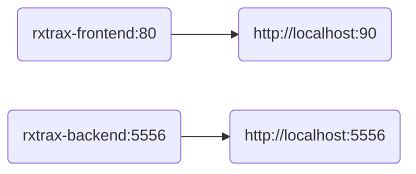

#  RxTrax

> - Choose prescription medications and dosage
> - Data will be stored in a SQLite database
> - Detailed information will be displayed

---

### Docker Compose Flow: <!-- markdownlint-disable-line MD001 -->


```mermaid
flowchart LR
frontend@{shape: rounded, label: "rxtrax-frontend:80"}
frontendPort@{shape: rounded, label: "http://localhost:90"}
backend@{shape: rounded, label: "rxtrax-backend:5556"}
backendPort@{shape: rounded, label: "http://localhost:5556"}
frontend-->frontendPort
backend-->backendPort
```

---

### To build all images

```bash
./build.sh
```

---

### Additional documentation available

- [Frontend](./frontend/README.md "Frontend")
- [Backend](./backend/README.md "Backend")
